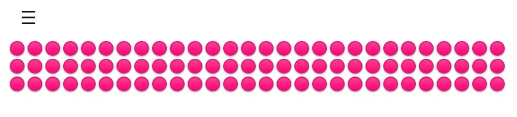

# Draggable Button Editor

## Acceso Rápido a la Aplicación
[Draggable Button Editor](https://xococode.github.io/Botonesarrastables.github.io/)

## Descripción

Este proyecto es un editor interactivo de botones arrastrables que permite a los usuarios agregar, editar, guardar y cargar botones de forma dinámica. La interfaz amigable incluye un sidebar desplegable para acciones adicionales y un contenedor principal donde se pueden arrastrar y reorganizar los botones.

## Características

- **Agregar Botones**: Permite a los usuarios agregar nuevos botones dinámicamente a la interfaz.
- **Editar Botones**: Los botones pueden ser editados mediante doble clic para cambiar su contenido y valor.
- **Arrastrar y Soltar**: Los botones son arrastrables para permitir una reorganización fácil dentro del contenedor.
- **Guardar y Cargar**: Funcionalidades para guardar la configuración actual de los botones en un archivo JSON y cargarla posteriormente.
- **Sidebar Desplegable**: Un sidebar fijo para acciones como agregar, guardar y cargar botones.
- **Estilos Personalizados**: Diseño moderno y responsive para una mejor experiencia de usuario.
- **Compatibilidad Multinavegador**: Funciona correctamente en los navegadores modernos principalmente: Chrome, Firefox, Edge y Safari.
